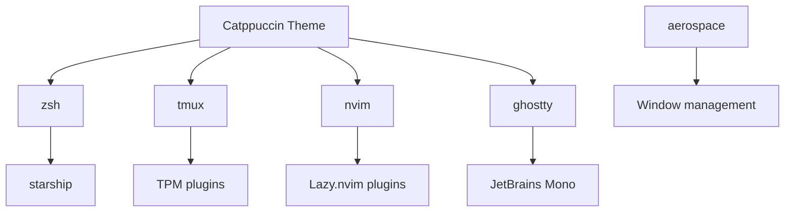

# Package Documentation

Detailed documentation for each package in the Neu-Alkemy dotfiles.

## Package Structure

Each package follows GNU Stow conventions:
```
package-name/
├── .config/          # → ~/.config/
├── .file             # → ~/.file
└── README.md         # Package-specific docs
```

## Core Packages

### aerospace
**Purpose**: Tiling window manager for macOS  
**Target**: `~/.aerospace.toml`  
**Dependencies**: AeroSpace app

**Key Features**:
- Vim-style navigation (`alt+hjkl`)
- Workspace management
- Window tiling and floating modes
- Custom keybindings for productivity

**Key Bindings**:
- `alt+h/j/k/l` - Focus window
- `alt+shift+h/j/k/l` - Move window
- `alt+1-9` - Switch workspace
- `alt+shift+1-9` - Move window to workspace

### ghostty
**Purpose**: GPU-accelerated terminal emulator  
**Target**: `~/.config/ghostty/`  
**Dependencies**: Ghostty app, JetBrains Mono Nerd Font

**Key Features**:
- Hardware acceleration
- True color support
- Customizable transparency
- Catppuccin Mocha theme

**Configuration Highlights**:
- Font: JetBrains Mono Nerd Font, size 14
- Background opacity: 40%
- Theme: Catppuccin Mocha

### nvim
**Purpose**: Neovim configuration with modern plugins  
**Target**: `~/.config/nvim/`  
**Dependencies**: Neovim 0.9+, ripgrep, fd

**Key Features**:
- Lazy.nvim plugin manager
- LSP integration
- Telescope fuzzy finder
- Treesitter syntax highlighting
- Neo-tree file explorer
- Transparent background

**Plugin Highlights**:
- **lazy.nvim**: Plugin manager
- **telescope.nvim**: Fuzzy finder
- **nvim-lspconfig**: LSP client
- **nvim-treesitter**: Syntax highlighting
- **neo-tree.nvim**: File explorer
- **catppuccin**: Color scheme

**Key Bindings**:
- `<leader>` = `<space>`
- `<leader>ff` - Find files
- `<leader>fg` - Live grep
- `<leader>e` - Toggle file explorer

### opencode
**Purpose**: AI coding agent configuration  
**Target**: `~/.config/opencode/`  
**Dependencies**: OpenCode CLI

**Key Features**:
- Custom agent definitions (Metis, Noesis, Tekton)
- Neu-Alkemy theme
- Project templates
- Skills and prompts

**Agents**:
- **Metis**: Planning and architecture
- **Noesis**: Research and analysis  
- **Tekton**: Implementation and building

### scripts
**Purpose**: Development workflow automation  
**Target**: `~/scripts/`  
**Dependencies**: tmuxp

**Scripts**:
- `start_jump.sh`: Launch Jump development environment
- `start_learn.sh`: Launch learning environment

### tmux
**Purpose**: Terminal multiplexer configuration  
**Target**: `~/.tmux.conf`, `~/.tmux/`, `~/.tmuxp/`  
**Dependencies**: tmux, TPM (Tmux Plugin Manager)

**Key Features**:
- Custom prefix key (`Ctrl-a`)
- Vim-style pane navigation
- Catppuccin status bar
- Plugin management with TPM
- Session templates with tmuxp

**Key Bindings**:
- `Ctrl-a` - Prefix key
- `prefix + h/j/k/l` - Navigate panes
- `prefix + |` - Split vertically
- `prefix + -` - Split horizontally
- `prefix + I` - Install plugins

**Plugins**:
- **catppuccin/tmux**: Status bar theme
- **christoomey/vim-tmux-navigator**: Seamless vim/tmux navigation

### zsh
**Purpose**: Zsh shell configuration  
**Target**: `~/.zshrc`, `~/.config/starship.toml`  
**Dependencies**: zsh, oh-my-zsh, starship

**Key Features**:
- Oh-my-zsh framework
- Starship prompt
- Vi-mode keybindings
- Catppuccin colors
- Useful aliases and functions

**Prompt Features**:
- Git status integration
- Directory navigation
- Command execution time
- Exit code indicators

## Theme Integration

All packages use the **Catppuccin Mocha** color palette for consistency:
- **Base**: `#1e1e2e`
- **Mantle**: `#181825`
- **Crust**: `#11111b`
- **Text**: `#cdd6f4`
- **Blue**: `#89b4fa`
- **Mauve**: `#cba6f7`
- **Green**: `#a6e3a1`

## Dependencies

### System Dependencies
```bash
# Core tools
brew install stow neovim tmux starship tmuxp asdf

# GUI applications  
brew install --cask ghostty nikitabobko/tap/aerospace font-jetbrains-mono-nerd-font
```

### Plugin Dependencies
- **TPM**: Tmux Plugin Manager (auto-installed)
- **Lazy.nvim**: Neovim plugin manager (auto-installed)
- **Oh-my-zsh**: Zsh framework (manual install recommended)

## Package Relationships



## Customization Points

Each package can be customized independently:
- **Colors**: Modify theme files
- **Keybindings**: Edit configuration files
- **Plugins**: Add/remove in respective config files
- **Features**: Enable/disable specific functionality

For detailed customization guides, see [CUSTOMIZATION.md](CUSTOMIZATION.md).